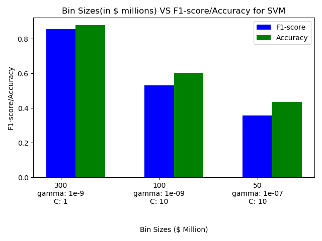
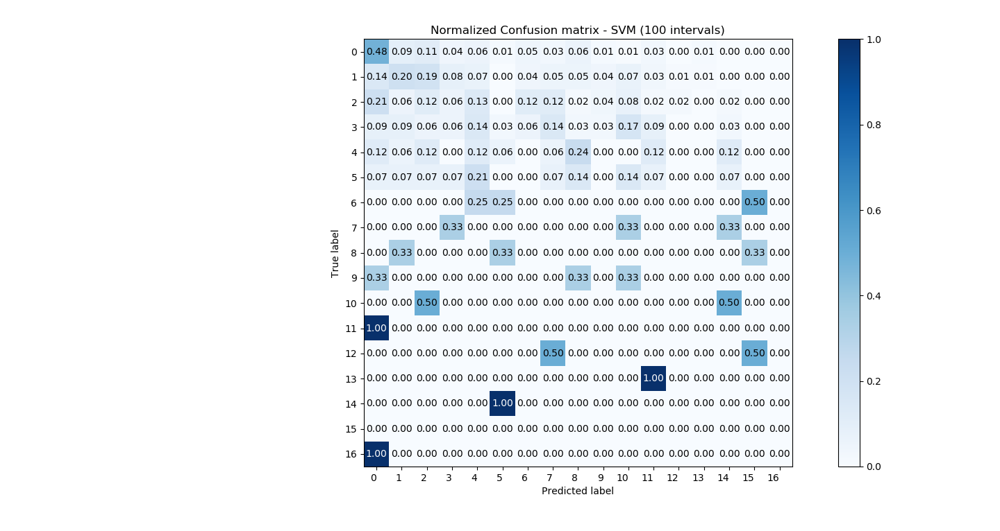

# Project title: Movie Revenue Prediction
## Team members: Sanmesh, Aaron, Tarushree, Aastha, Prithvi, George

---

   

# 1. Overview of the project and Motivation 
### Motivation: 
To predict the Box office revenue of a movie based on it's characteristics. 
Our analysis will allow Directors/Producers to decide on what characteristics of the movie will affect their box office revenue, and what to modify in their selection of actors or investment in the movies to maximize their profit. Such analysis will also allow other interested third parties to predict the success of a film before it is released. 
We aim to find the variables most associated with film revenue, and to see how the various revenue prediction models are affected by them.

---
# 2. Dataset and visualization 

### (1). Dataset: The Movies DataBase (TMDB) 5000 Movie Dataset (from Kaggle)
#### Features in the dataset: 24 features in total &nbsp;&nbsp;&nbsp;
<!--
1. ID    &nbsp;&nbsp;&nbsp;&nbsp;&nbsp;&nbsp;&nbsp;&nbsp;&nbsp;2. movie_id
3. title &nbsp;&nbsp;&nbsp;&nbsp;&nbsp;&nbsp;&nbsp;&nbsp;&nbsp;4. cast
5. crew
6. budget
7. genres
8. homepage
9. id
10. keywords
11. original_language
12. original_title
13. overview
14. popularity
15. production_companies
16. production_countries
17. release_date
18. revenue
19. runtime
20. spoken_languages
21. status
22. tagline
23. title
24. vote_average
25. vote_count  
-->
<table>

  <tr>
    <td>ID</td>
    <td>Title</td>
    <td>crew</td>
  </tr>
  <tr>
    <td>budget</td>
    <td>genres</td>
    <td>homepage</td>
  </tr>
  <tr>
    <td>id</td>
    <td>keywords</td>
    <td>original_language</td>
  </tr>
  <tr>
    <td>original_title/td>
    <td>overview</td>
    <td>popularity</td>
  </tr>
  <tr>
    <td>production_companies</td>
    <td>production_countries</td>
    <td>release_date</td>
  </tr>
  <tr>
    <td>revenue</td>
    <td>runtime</td>
    <td>spoken_languages</td>
  </tr>
  <tr>
    <td>status</td>
    <td>tagline</td>
    <td>title</td>
  </tr>
  <tr>
    <td>vote_average</td>
    <td>vote_count</td>
    <td></td>
  </tr>
</table>

#### Visualization: 
Binning movies into Revenue bins of 100 Million

  

---
# 3. Data pre-processing
#### Steps followed for Data cleaning & Data pre-processing:
- Removal of data points with missing revenues
- Removing zero REVENUES from the data 
- Adjusting revenue for inflation.
- Separation of year into Year and day of the year, since we theorized that film revenue will be highly correlated with which season the movie is released in.
- Encoding categorical features: conversion of data into binary format.
  - Different classes in a column (Lists) allotted their own column, and each row will indicate if column existed or not by assigning either a 1 or a 0. 
- Data was then divided into Test Validation and Training sets (60%, 20% and 20%) for further model training and testing.

---
# 4. Feature Reduction 

Our data has 10955 features, which is huge, especially in relation to the 3376 data points. To reduce the number of features to increase speed of running supervised learning algorithms for revenue prediction of the movies, feature reduction was deemed required. To achieve this, PCA and feature selection were pursued.
 
### (1). PCA (Sanmesh)
 
PCA was done in two ways:
1. (PCA_noScale_20Comp) Data wasn't scaled, and number of principal components selected = 20
2. (PCA_Scale_0.995VarRecov) Z-Score normalization was done on the features, and number of principal components = # to recover 99% of the variance. To achieve normalization, remove the mean of the feature and scale to unit variance. The Z-Score of a sample x is calculated as: z = (x - u) / s.

#### PCA_noScale_20Comp DETAILS
Recovered Variance: 99.99999999999851  
Original # features: 10955  
Reduced # features: 20  
Recovered Variance Plot Below for PCA_noScale_20Comp%    
Note: Huge first principal component is probably due to othe feature of budget, which is much bigger than all other features (average = 40,137,051.54)  

  

#### PCA_Scale_99%VarRecov DETAILS
Recovered Variance:  99.00022645866223  
Original # features: 10955  
Reduced # features: 2965  
Recovered Variance Plot Below for PCA_Scale_99%VarRecov  

  

### (2). Feature selection (Prithvi)

#### Using XGBRegressor

We used XGBRegressor to check out the correlation of various features to the revenue. 
Once we visualized the graphs we then manually set a threshold and gathered 150 features for testing our models on.

#### Graphs

##### Feature importances of encoded movie data
######  2000 features sorted by feature importance scores of XGBRegressor

  

###### 150 to 200 features feature importance scores of XGBRegressor

To determine threshold for cutoff for feature selection

  

##### Top 25 Revenue predictors

  

# 5. Movie Revenue Prediction 

## Experiments and Model Testing

  

### Linear ridge regression (Sanmesh)

<<<<<<< Updated upstream
First, we tried to predict the exact revenue of the test set of movies using linear ridge regression. Ridge regression was chosen because it would it would protect against overfitting of the data, especially when there are a huge number of features. 
=======
First, we tried to predict the exact revenue of the test set of movies using linear ridge regression. Ridge regression was chosen because it would protect against overfitting of the data, especially when there are huge number of features. 
>>>>>>> Stashed changes
Cross validation was performed to find the optimal alpha or regularization value.
The data sets were the two PCA data sets, and the feature selection dataset mentioned previously. Ridge Regression was trained on 80% of each data set, and then finally tested on the remaining 20% of the data sets.  The results are below.

### (1). PCA No scaling, 20 components
RMSE: 160266397.7589437  
R2 score 0.49805732362034183  

### (2). PCA Scaling,99% variance recovery:
RMSE: 225957444.3019453  
R2 score 0.00224829444458019  

### (3). Feature Selection:
RMSE: 126001088.6944168  
R2 score 0.6897457309459162  

Comparing RMSE and R2 of Ridge Regression on Three Input Data

  

  

<<<<<<< Updated upstream
The plots below are the predicted vs actual revenue predicted from Ridge Regression. The data was sorted by the actual y values in order to make it easier to view the results. Alpha was determined through kfold method and was 0.5 for feature selection.  
=======
The plots below are the predicted revenue vs actual revenue from Ridge Regression. The data was sorted by the actual y revenue values in order to make it easier to view the results. Alpha was determined through kfold method (Leave-one-out cross validation) and was 0.5 for feature selection.  
>>>>>>> Stashed changes

Revenue Prediction with PCA_noScale_20Comp data as input

  

  
Revenue Prediction with PCA_Scale_99%VarRecov data as input

  

  
  
Revenue Prediction with Feature Selection data as input

  

Closeup of Revenue Prediction with Feature Selection data as input

  

### (3). Results (Sanmesh)

##### TABLES ( PLACEHOLDER DATA)

##### Classification 
|                        |          |                    F1 SCORE                                 |                   ACCURACY                                  |
|------------------------|----------|--------------------|--------------------|-------------------|--------------------|--------------------|-------------------|
| Models                 | Features | Bin Size: 300$ (M) | Bin Size: 100$ (M) | Bin Size: 50$ (M) | Bin Size: 300$ (M) | Bin Size: 100$ (M) | Bin Size: 50$ (M) |
| Support Vector Machine |          |                    |                    |                   |                    |                    |                   |
| Support Vector Machine |          |                    |                    |                   |                    |                    |                   |
| Random Forest          |          |                    |                    |                   |                    |                    |                   |
| Random Forest          |          |                    |                    |                   |                    |                    |                   |

##### Regression
| Models           | RMSE | R^2 |
|------------------|:----:|----:|
| Ridge Regression |   3  |   1 |

#####  PLOTS & CHARTS

ToDo

------------

The ranking of the input data that gave the highest R^2 scores and lowest RMSE values from best to worst are:
1. Feature Selection 
2. PCA No scaling, 20 components  
3. PCA Scaling, 99% variance recovery

Feature Selection gave us the best performance for ridge regression. Our target R^2 value to indicate a good model is 0.6 to 0.9, according to this literature [1], and this is acheived only through the feature selection data input with ridge regression. Thus we deam ridge regression model with feature selection input as a success in predicting movie revenue.

We can see that for feature selection input, there is bigger error in prediction for bigger test revenues. The predicted revenue plot does have a similar shape to the actual revenue, this showing that the prediction values are trying to follow the actual values. However, the predicted value is not able to keep up with the increase of the actual revenue. This may be because there is a smaller % of actual revenues that are bigger. This may be corrected by having a bigger dataset to train on than only having 3376 samples. 

It isn't clear completely why feature selection performs better than PCA, but one factor may be that there are some features such as a particular actor name, with values only binary 1 or 0 indicating whether the actor is in the movie. So maybe PCA doesn't work as well on binary value features, and there is conflicting opinion on why this is the case in the community. Maybe in the future, we will look into other methods of encoding the feature of actors into numerical data. One potential example is having one feature for all actors, and just encoding the actors into a numerical value from 0 to the # of actors.
  
What is interesting is that the PCA data with normalization performed worse than the PCA without normalization. It is counterintuitive because the goal of PCA is to identify the axis with the most variance, and this goal may be impeded when one feature has much bigger values than other features (in our case, the feature is budget). However, the non-normalized PCA might have performed better because the data captures the budget mainly in the first principal component. We see from our correlation graphs and other literature [1] that budget is one of the leading indicators to predicting movie revenue, so it makes sense that when using PCA data without normalization, it will perform better than pca with normalization. 

# 6. Classification Models ()

### Binning of Y values 

### SVM

  

  

  

  

  

 

We have plotted our depicted our SVM classification results for both bin sizes below:

  

 

  

 

Although we have achieved high accuracy and F1-score, we see from the confusion matrix that majority of our test instances are predicted to be in bin 0 or 1. This can be explained by class imbalance in the training data. There are more number of examples which belong to class 0 and 1 as compared to other categories. To overcome this challenge, we explored Random Forest which performs better with class imbalance in training data.

Another possible avenue to explore for this class imbalance problem with SVM would be to increase the penalty for misclassifying minority classes. This could be done by inversely weighing 'C' with class size. This could be explored in future.

 
<h2>Random Forest</h2>
 

 We used Random Forest as another classification model inorder to classify the movie data into correct Revnue category. We have experimented with a some parameters like number of estimators and maximum depth parameters for the Random Forest model.
  

<h3>Number of Estimators</h3>

Number of estimators are used to specify the number of trees in the forest. Generally, a higher n=value for the number of trees results in better learning and higher accuracy. But, adding a huge number of trees can make the training and inference process go slow. Hence, we have used a search method to find the best value of n_estimator.

We experimented by fitting Random forest with trees having number of estimators ranging from 1 to 500. Then we plot the F1-score against the Depths.

We observed that as we increase the number of estimators, the F1 score increases to attain its highest value and then it becomes almost constant as we keep increasing the number of estimators further.

We choose the n_estimators parameter corresponding to the highest F1 score value to be the best value.

Below are the graphs for 2 different Bin sizes - 100 and 300.

  

Bin size = 300

  

   

Bin size = 100

 
  

 
<h3>Maximum Depth of the Trees</h3>

Maximum Depth stands for the depth of each tree in the forest. More the depth of the tree, the more splits it has and more is the tendency to captures fine information about the data. 

We experimented by fitting Random forest with trees having depths ranging from 1 to 250. Then we plot the F1-score against the Depths.

We observed that as we increase the depth of the decision trees, the F1 score increases intitially. But as we keep increasing the depth further, the F1 score falls slightly and then it plateaus to attain a contant value.

We choose the depth corresponding to the highest F1 score value to be the best Depth value.

Below are the graphs for 2 different Bin sizes - 100 and 300.

  

Bin size = 300

  

  

Bin size = 100

  

 
<h3>Error Visualization</h3>
  
1. As there are more number of data points in later bins as compared to the initial bins, we see that the error is higher in later bins.   
2. Also, we observed that the error is higher incase of 100 bins as compared to when we have 300 bins. This shows that having more number of classes is leading the model to clearly segregate the data by grouping the data points more efficiently.

  

Bin size = 300

  

  

Bin size = 100

  

  

# 7. Final Conclusions

sduqiwo

Checking checking checking 
 

# 8. Reference
[1] What makes a successful film? Predicting a film’s revenue and user rating with machine learning. (2019). Retrieved 28 September 2019, from https://towardsdatascience.com/what-makes-a-successful-film-predicting-afilms-revenue-and-user-rating-with-machine-learning-e2d1b42365e7 
[2] h98uesrhmdifvherdsfredsiojfveioadschj 8aerdsh ciofvjerdiosjcf[mxerwjds9gtkvsed
[3] arkpofaewksporkfweoskrpfksdpokafkewdsofkesdopxrkopfwae,csporkf4	wq[dskxf
