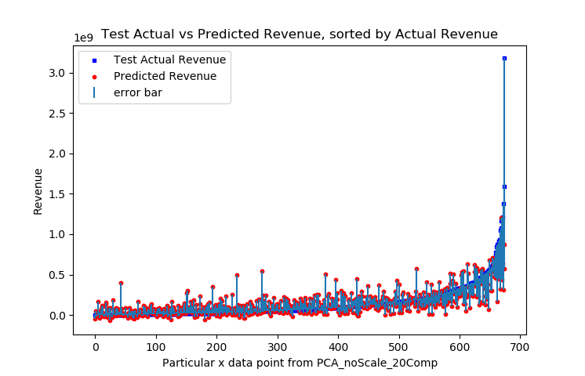

# Project title: Movie Revenue Prediction
## Team members: Sanmeshkumar Udhayakumar, Aaron Reich, Tarushree Gandhi, Aastha Agrawal, Prithvi Alva Suresh  
## 7641 Team2

---

   

# 1. Overview of the project and Motivation 
### Motivation: 
The goal of our project is to predict the Box office revenue of a movie based on it's characteristics. 
Our analysis will not only allow Directors/Producers to predict how much money their movie will make, but it will also allow them to justify their movie characteristics, such as movie budget and choice of actors in order to reach a certain revenue. Directors/Producers can also understands what to modify in their selection of actors or investment in the movies to maximize their profit. Such analysis will also allow other interested third parties to predict the success of a film before it is released.                  
In the process of our analysis, we also aim to find the variables most associated with film revenue, and to see how the various revenue prediction models are affected by them.

---
# 2. Dataset and visualization 

### Dataset: The Movies DataBase (TMDB) 5000 Movie Dataset (from Kaggle)
#### Features in the dataset: 10 features in total &nbsp;&nbsp;&nbsp;
<!--
1. budget    &nbsp;&nbsp;&nbsp;&nbsp;&nbsp;&nbsp;&nbsp;&nbsp;&nbsp;2. genres
3. keywords &nbsp;&nbsp;&nbsp;&nbsp;&nbsp;&nbsp;&nbsp;&nbsp;&nbsp;4. production companies
5. release date
6. runtime
7. spoken_languages
8. status
9. cast
10. crew  
-->
<table>
  <tr>
    <td>Budget</td>
    <td>Genres</td>
    <td>Keywords</td>
    <td>Production Companies</td>
    <td>Crew</td>
  </tr>
  <tr>
    <td>Release Date</td>
    <td>Runtime</td>
    <td>Spoken Languages</td>
    <td>Status</td>
    <td>Cast</td>
  </tr>
</table>

#### Visualization: 
Preliminary visualization to see the distribution of revenue's of the Movies we are studying.
We sorted movies into appropriate bin size ($100 million) to view the frequency of movies belonging to each bin size.

  

---
# 3. Data pre-processing
#### Steps followed for Data cleaning & Data pre-processing:
- Removal of data points with missing revenues
- Removing zero REVENUES from the data 
- Adjusting revenue for inflation.
- Separation of Date into Year and day of the year, since we theorized that film revenue will be highly correlated with which season the movie is released in.
- Encoding categorical features: conversion of data into binary format.
  - Different classes in a column (Lists) allotted their own column, and each row will indicate if column existed or not by assigning either a 1 or a 0. 
  - If Stan Lee is in the list of producers for any movie, then now 'Stan Lee' will become a binary feature. If a movie has Stan Lee as the producer the feature will be a 1, otherwise it'll be a 0.
- Data was then divided into Test, Validation, and Training sets (60%, 20% and 20%) for further model training and testing.

---
# 4. Feature Reduction 

Our data has 10955 features, which is huge, especially in relation to the 3376 data points. To reduce the number of features to increase speed of running supervised learning algorithms for revenue prediction of the movies, feature reduction was deemed required. To achieve this, PCA and feature selection were pursued.
 
### (1). PCA 
 
PCA was done in two ways:
1. (PCA_noScale_20Comp) Data wasn't scaled, and number of principal components selected = 20
2. (PCA_Scale_0.995VarRecov) Z-Score normalization was done on the features, and number of principal components = # to recover 99% of the variance. To achieve normalization, remove the mean of the feature and scale to unit variance. The Z-Score of a sample x is calculated as: z = (x - u) / s.

#### PCA_noScale_20Comp DETAILS
Recovered Variance: 99.99999999999851%  
Original # features: 10955  
Reduced # features: 20  
Recovered Variance Plot Below for PCA_noScale_20Comp%    
Note: Huge first principal component is probably due to othe feature of budget, which is much bigger than all other features (average = 40,137,051.54)  

  

#### PCA_Scale_99%VarRecov DETAILS
Recovered Variance:  99.00022645866223%  
Original # features: 10955  
Reduced # features: 2965  
Recovered Variance Plot Below for PCA_Scale_99%VarRecov  

  

### (2). Feature selection 

#### Using XGBRegressor

We used XGBRegressor to check out the correlation of various features to the revenue. 
Once we visualized the graphs we then manually set a threshold and gathered 150 features for testing our models on.

#### Graphs

##### Feature importances of encoded movie data
######  2000 features sorted by feature importance scores of XGBRegressor

  

###### 150 to 200 features feature importance scores of XGBRegressor

To determine threshold for cutoff for feature selection

  

##### Top 25 Revenue predictors

  

# 5. Movie Revenue Prediction 

## Experiments and Model Testing

  

### Linear Ridge Regression  

First, we tried to predict the exact revenue of the test set of movies using linear ridge regression. Ridge regression was chosen because it would protect against overfitting of the data, especially when there are huge number of features. 
Cross validation was performed to find the optimal alpha or regularization value.
The data sets were the two PCA data sets, and the feature selection dataset mentioned previously. Ridge Regression was trained on 80% of each data set, and then finally tested on the remaining 20% of the data sets.  The results are below.

### (1). PCA No scaling, 20 components
RMSE: 160266397.7589437  
Normalized RMSE: 0.050410109822282445    
R2 score 0.49805732362034183  

### (2). PCA Scaling,99% variance recovery:
RMSE: 225957444.3019453  
Normalized RMSE: 0.07107253761050907  
R2 score 0.00224829444458019  

### (3). Feature Selection:
RMSE: 126001088.6944168  
Normalized RMSE: 0.03963231723948973   
R2 score 0.6897457309459162  

Comparing RMSE and R2 of Ridge Regression on Three Input Data

  

  

The plots below are the predicted revenue vs actual revenue from Ridge Regression. The data was sorted by the actual y revenue values in order to make it easier to view the results. Alpha was determined through kfold method (Leave-one-out cross validation) and was 0.5 for feature selection.  

Revenue Prediction with PCA_noScale_20Comp data as input

  

  
Revenue Prediction with PCA_Scale_99%VarRecov data as input

  

  
  
Revenue Prediction with Feature Selection data as input

  

Closeup of Revenue Prediction with Feature Selection data as input

  

------------
### Linear Ridge Regression Results  
The ranking of the input data that gave the highest R^2 scores and lowest RMSE values from best to worst are:
1. Feature Selection 
2. PCA No scaling, 20 components  
3. PCA Scaling, 99% variance recovery

Feature Selection gave us the best performance for ridge regression. Our target R^2 value to indicate a good model is 0.6 to 0.9, according to this literature [1], and this is acheived only through the feature selection data input with ridge regression. Thus we deam ridge regression model with feature selection input as a success in predicting movie revenue.

We can see that for feature selection input, there is bigger error in prediction for bigger test revenues. The predicted revenue plot does have a similar shape to the actual revenue, this showing that the prediction values are trying to follow the actual values. However, the predicted value is not able to keep up with the increase of the actual revenue. This may be because there is a smaller % of actual revenues that are bigger. This may be corrected by having a bigger dataset to train on than only having 3376 samples. 

It isn't clear completely why feature selection performs better than PCA, but one factor may be that there are some features such as a particular actor name, with values only binary 1 or 0 indicating whether the actor is in the movie. So maybe PCA doesn't work as well on binary value features, and there is conflicting opinion on why this is the case in the community. Maybe in the future, we will look into other methods of encoding the feature of actors into numerical data. One potential example is having one feature for all actors, and just encoding the actors into a numerical value from 0 to the # of actors.
  
What is interesting is that the PCA data with normalization performed worse than the PCA without normalization. It is counterintuitive because the goal of PCA is to identify the axis with the most variance, and this goal may be impeded when one feature has much bigger values than other features (in our case, the feature is budget). However, the non-normalized PCA might have performed better because the data captures the budget mainly in the first principal component. We see from our correlation graphs and other literature [1] that budget is one of the leading indicators to predicting movie revenue, so it makes sense that when using PCA data without normalization, it will perform better than pca with normalization.
     
# 7 Final Conclusions (still testing2)  

##### TABLES

##### Classification 

  

#### Regression

  

Overall, for dataset dimension reduction, feature selection worked the best across all the supervised learning algorithms.  Ridge regression showed promising results in predicting the revenue, with a R^2 value of 0.69, which is within the range of 0.6 to 0.9, indicating a good model according to [1]. For our classfication models SVM and Random forest two bin sizes (100 million and 300 million) were experimented with and we achieve higher accuracy with the bigger - 300 bin size. However, both SVM and Random Forest are affected by the class imbalance problem in the training data.
  
# 8. Reference
<ol>
<li>What makes a successful film? Predicting a film’s revenue and user rating with machine learning. (2019). Retrieved 28 September 2019, from https://towardsdatascience.com/what-makes-a-successful-film-predicting-afilms-revenue-and-user-rating-with-machine-learning-e2d1b42365e7
<li>Dan Cocuzzo, Stephen Wu, "Hit or Flop: Box Office Prediction for Feature Films", Stanford University, 2013.</li>
<li>Nahid Quader, Md. Osman Gani, Dipankar Chaki, and Md. Haider Ali, “A Machine Learning Approach to Predict Movie Box-Office Success,”in 20th International Conference of Computer and Information Technology (ICCIT), December 2017.</li>
<li>Mahesh Joshi, Dipanjan Das, Kevin Gimpel, and Noah A. Smith. Movie reviews and revenues: an experiment in text regression. In Human Language Technologies: The 2010 Annual Conference of the North American Chapter of the Association for Computational Linguistics, HLT ’10, 2010.</li>
<li>W. Zhang, S. Skiena Improving movie gross prediction through news analysis International joint conference on web intelligence and intelligent agent technology, IEEE/WIC/ACM (2009)</li>
</ol>

# 9. Contributions

<ol>
<li>Proposal- Sanmesh, Aaron, Tarushree, Aastha, Prithvi</li>
<li>Overview and Project Motivation - Prithvi, Sanmesh</li>
<li>Dataset visualization - Prithvi</li>
<li>Feature Selection - Prithvi</li>
<li>PCA -  Sanmesh</li>
<li>Ridge Regression- Aastha, Sanmesh</li>
<li>SVM - Aaron, Tarushree, Aastha, Prithvi, Sanmesh</li>
<li>Random Forest - Aaron, Tarushree, Aastha, Sanmesh</li>
</ol>